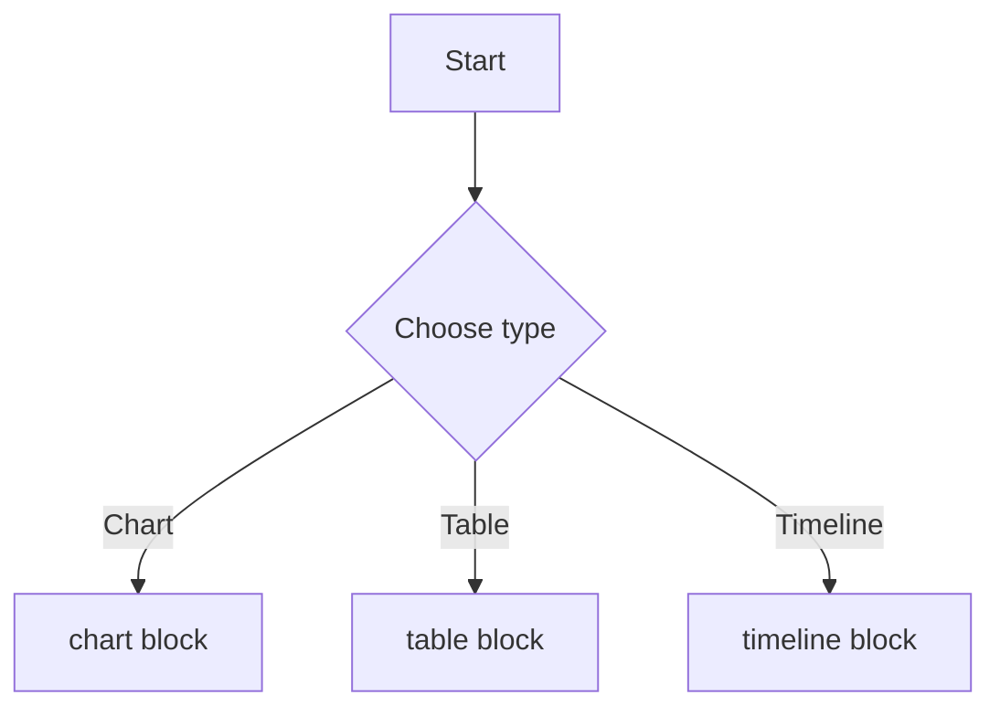

## Markdown Presentation Format Documentation

### Complete Example Presentation

```markdown
---
title: Advanced Markdown to PowerPoint
author: John Doe
company: Tech Corp
theme: material_blue
aspect_ratio: 16:9
footer: © 2024 Tech Corp
slide_numbers: true
date: true
colors:
  primary: "#2196F3"
  secondary: "#FF5722"
  accent: "#4CAF50"
  background: "#FFFFFF"
  text: "#212121"
font: Segoe UI
variables:
  year: 2024
  product_name: PowerPoint Converter
---

# {{product_name}}
## Transform Markdown to Professional Presentations

<!-- notes: Welcome everyone to the presentation about our new PowerPoint converter -->

---
<!-- slide: section -->
<!-- transition: fade 2 -->

## Agenda

---
<!-- slide: content -->
<!-- background: #F5F5F5 -->

### Today's Topics

- Introduction to Markdown Syntax
- Visual Features and Tags
- Live Demonstration
- Q&A Session

<!-- notes: We'll cover all the essential features in about 20 minutes -->

---
<!-- slide: two_column -->

### Features Comparison

::: columns
**Traditional Method**
- Manual formatting
- Time consuming
- Inconsistent styling
- Limited automation

|||

**Markdown Method**
- Automated formatting
- Fast creation
- Consistent themes
- Full automation
:::

---
<!-- slide: chart -->
<!-- animate: fade 1 -->

### Performance Metrics

```chart
type: column
data:
  categories: [Q1, Q2, Q3, Q4]
  series:
    - name: Traditional
      values: [45, 52, 48, 58]
    - name: Markdown
      values: [78, 85, 92, 95]
options:
  title: Productivity Comparison

```

---

<!-- slide: table -->

### Feature Matrix

```
headers: [Feature, Basic, Pro, Enterprise]
rows:
  - [Slides per month, 10, 100, Unlimited]
  - [Templates, 5, 20, 50+]
  - [Export formats, PPTX, PPTX/PDF, All]
  - [Support, Email, Priority, Dedicated]
style: striped

```

---

<!-- slide: timeline -->

### Project Timeline

```
style: horizontal
events:
  - date: Jan 2024
    title: Project Kickoff
    description: Initial planning
  - date: Mar 2024
    title: Beta Release
    description: Limited testing
  - date: Jun 2024
    title: Public Launch
    description: Full release
  - date: Sep 2024
    title: Version 2.0
    description: Advanced features

```

---

<!-- slide: code -->

### Code Example

```python
from markdown_pptx import MarkdownConverter

converter = MarkdownConverter()
presentation = converter.convert(
    markdown_file="presentation.md",
    template="corporate"
)
presentation.save("output.pptx")

```

---

<!-- slide: quote -->
<!-- background: linear-gradient(135deg, #667eea 0%, #764ba2 100%) -->

> "The best way to predict the future is to invent it."
> 

— Alan Kay, Computer Scientist

---

<!-- slide: image -->
<!-- layout: full -->

### Visual Impact


{width=8, y=2}

<!-- notes: This shows our new dashboard interface -->

---

<!-- slide: content -->
<!-- animate: fly_in -->

### Advanced Features {color:#2196F3}

::: box accent
**Smart Layouts**

- Automatic positioning
- Responsive scaling
- Grid alignment
:::

::: box warning
**Important Note**
Remember to save your work frequently
:::

<!-- qr:  -->

---

<!-- slide: team -->

### Our Team

```yaml
members:
  - name: Jane Smith
    role: Product Manager
    email: jane@company.com
  - name: Bob Johnson
    role: Lead Developer
    email: bob@company.com
  - name: Alice Brown
    role: UX Designer
    email: alice@company.com

```

---

<!-- slide: content -->
<!-- transition: dissolve -->

### Mathematical Formulas

The quadratic formula: $$x = \frac{-b \pm \sqrt{b^2 - 4ac}}{2a}$$

Statistics example: $$\sigma = \sqrt{\frac{1}{N}\sum_{i=1}^{N}(x_i - \mu)^2}$$

---

<!-- slide: title -->

# Thank You!

Questions? Contact us at {{product_name}}@company.com

<!-- timer: 300 -->
<!-- poll: What feature would you like to see next? -->

```

```

### Supported Tags and Syntax

### Slide markers

- `---` creates a new slide separator
- `<!-- slide: type -->` sets the slide type

Example:

```markdown
---
<!-- slide: section -->
## Agenda
```

### Visual features

- `<!-- background: color|gradient|image -->`
- `<!-- bg-image: path/url -->`
- `<!-- bg-video: path/url -->`
- `<!-- transition: fade|push|wipe duration -->`
- `<!-- animate: type delay -->`
- `<!-- layout: full|centered|split -->`
- `<!-- theme: name -->`

Examples:

```markdown
<!-- background: #F5F5F5 -->
<!-- transition: fade 2 -->
<!-- animate: fade 1 -->
```

### Content elements

- Images: `{width=X, height=Y}`
- Charts: fenced with `chart
- Tables: fenced with `table
- Code: fenced with `language
- Math: `$$ ... $$`
- Timeline: fenced with `timeline
- Mermaid: fenced with `mermaid

Examples:

```markdown
{width=6,](https://example.com/image.png){width=6,) y=2}
```

```
type: column
data:
  categories: [Q1, Q2, Q3, Q4]
  series:
    - name: Traditional
      values: [45, 52, 48, 58]
    - name: Markdown
      values: [78, 85, 92, 95]
options:
  title: Productivity Comparison
```

```
headers: [Feature, Basic, Pro, Enterprise]
rows:
  - [Slides per month, 10, 100, Unlimited]
  - [Templates, 5, 20, 50+]
  - [Export formats, PPTX, PPTX/PDF, All]
  - [Support, Email, Priority, Dedicated]
style: striped
```

```
style: horizontal
events:
  - date: Jan 2024
    title: Project Kickoff
  - date: Mar 2024
    title: Beta Release
  - date: Jun 2024
    title: Public Launch
  - date: Sep 2024
    title: Version 2.0
```



### Advanced features

- Columns: `::: columns ... ||| ... :::`
- Boxed content: `::: box type ... :::`
- Inline styling: `{color:#hex}` `{size:Xpt}` `{align:left|center|right}`
- Variables: `product_name`
- Include: `<!-- include: file -->`

Examples:

```markdown
::: columns
Left column item 1
- point A
|||
Right column item 1
- point B
:::
```

```markdown
::: box warning
**Important Note**
Remember to save your work frequently
:::
```

### Metadata and speaker tools

- Notes: `<!-- notes: text -->`
- Speaker: `<!-- speaker: name -->`
- Timer: `<!-- timer: seconds -->`
- Poll: `<!-- poll: question -->`
- QR: `<!-- qr: data -->`

Examples:

```markdown
<!-- notes: Welcome everyone to the presentation -->
<!-- timer: 300 -->
<!-- poll: What feature would you like to see next? -->
```

### Usage examples

```python
# Basic usage
converter = MarkdownToPowerPoint()
result = await converter.convert(markdown_content, "output.pptx")

# With template
result = await converter.convert(
    markdown_content,
    "presentation.pptx",
    template="corporate"
)

# From file
result = await converter.convert_file(
    "[presentation.md](http://presentation.md)",
    "output.pptx"
)
```
